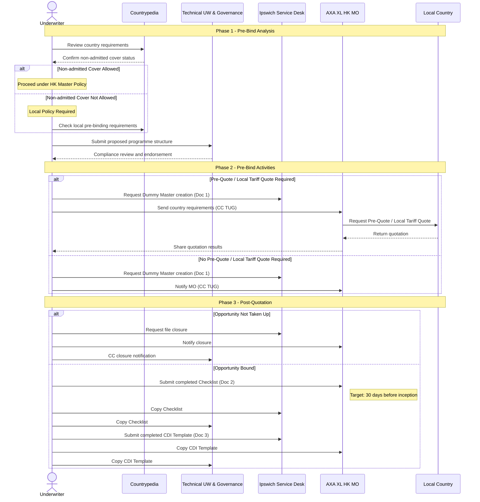

```mermaid
sequenceDiagram
    actor UW as Underwriter
    participant CP as Countrypedia
    participant TUG as Technical UW & Governance
    participant IPSD as Ipswich Service Desk
    participant MO as AXA XL HK MO
    participant LC as Local Country

    Note over UW,LC: Phase 1 - Pre-Bind Analysis

    UW->>CP: Review country requirements
    CP-->>UW: Confirm non-admitted cover status

    alt Non-admitted Cover Allowed
        Note over UW: Proceed under HK Master Policy
    else Non-admitted Cover Not Allowed
        Note over UW: Local Policy Required
        UW->>CP: Check local pre-binding requirements
    end

    UW->>TUG: Submit proposed programme structure
    TUG-->>UW: Compliance review and endorsement

    Note over UW,LC: Phase 2 - Pre-Bind Activities

    alt Pre-Quote / Local Tariff Quote Required
        UW->>IPSD: Request Dummy Master creation (Doc 1)
        UW->>MO: Send country requirements (CC TUG)

        MO->>LC: Request Pre-Quote / Local Tariff Quote
        LC-->>MO: Return quotation
        MO-->>UW: Share quotation results

    else No Pre-Quote / Local Tariff Quote Required
        UW->>IPSD: Request Dummy Master creation (Doc 1)
        UW->>MO: Notify MO (CC TUG)
    end

    Note over UW,LC: Phase 3 - Post-Quotation

    alt Opportunity Not Taken Up
        UW->>IPSD: Request file closure
        UW->>MO: Notify closure
        UW->>TUG: CC closure notification

    else Opportunity Bound
        UW->>MO: Submit completed Checklist (Doc 2)
        Note right of MO: Target: 30 days before inception

        UW->>IPSD: Copy Checklist
        UW->>TUG: Copy Checklist

        UW->>IPSD: Submit completed CDI Template (Doc 3)
        UW->>MO: Copy CDI Template
        UW->>TUG: Copy CDI Template
    end
```
