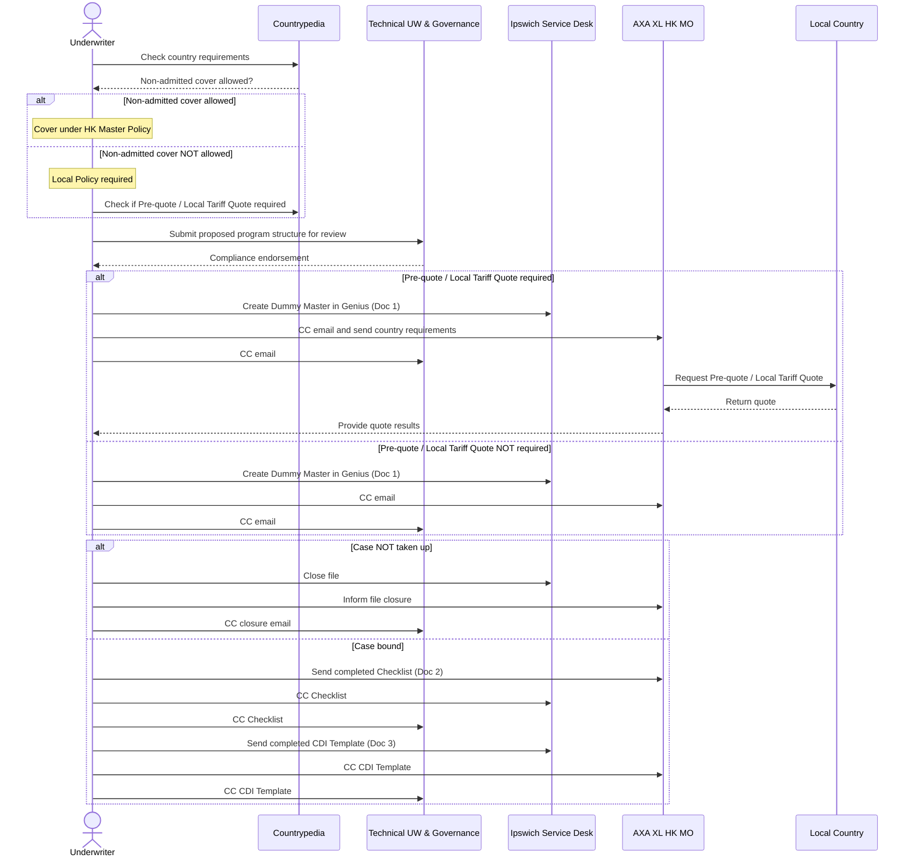

```mermaid
sequenceDiagram
    actor UW as Underwriter
    participant CP as Countrypedia
    participant TUG as Technical UW & Governance
    participant IPSD as Ipswich Service Desk
    participant MO as AXA XL HK MO
    participant LC as Local Country

    UW->>CP: Check country requirements
    CP-->>UW: Non-admitted cover allowed?

    alt Non-admitted cover allowed
        Note over UW: Cover under HK Master Policy
    else Non-admitted cover NOT allowed
        Note over UW: Local Policy required
        UW->>CP: Check if Pre-quote / Local Tariff Quote required
    end

    UW->>TUG: Submit proposed program structure for review
    TUG-->>UW: Compliance endorsement

    alt Pre-quote / Local Tariff Quote required
        UW->>IPSD: Create Dummy Master in Genius (Doc 1)
        UW->>MO: CC email and send country requirements
        UW->>TUG: CC email
        MO->>LC: Request Pre-quote / Local Tariff Quote
        LC-->>MO: Return quote
        MO-->>UW: Provide quote results
    else Pre-quote / Local Tariff Quote NOT required
        UW->>IPSD: Create Dummy Master in Genius (Doc 1)
        UW->>MO: CC email
        UW->>TUG: CC email
    end

    alt Case NOT taken up
        UW->>IPSD: Close file
        UW->>MO: Inform file closure
        UW->>TUG: CC closure email
    else Case bound
        UW->>MO: Send completed Checklist (Doc 2)
        UW->>IPSD: CC Checklist
        UW->>TUG: CC Checklist

        UW->>IPSD: Send completed CDI Template (Doc 3)
        UW->>MO: CC CDI Template
        UW->>TUG: CC CDI Template
    end
```
