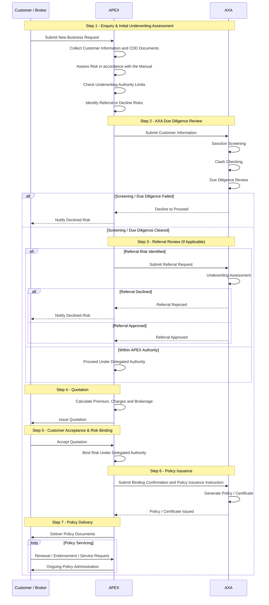

```mermaid
sequenceDiagram
    participant Customer as Customer / Broker
    participant APEX as APEX
    participant AXA as AXA

    Note over Customer,AXA: Step 1 - Enquiry & Initial Underwriting Assessment

    Customer->>APEX: Submit New Business Request

    APEX->>APEX: Collect Customer Information and CDD Documents
    APEX->>APEX: Assess Risk in accordance with the Manual
    APEX->>APEX: Check Underwriting Authority Limits
    APEX->>APEX: Identify Referral or Decline Risks

    Note over APEX,AXA: Step 2 - AXA Due Diligence Review

    APEX->>AXA: Submit Customer Information

    AXA->>AXA: Sanction Screening
    AXA->>AXA: Clash Checking
    AXA->>AXA: Due Diligence Review

    alt Screening / Due Diligence Failed
        AXA-->>APEX: Decline to Proceed
        APEX-->>Customer: Notify Declined Risk
    else Screening / Due Diligence Cleared

        Note over APEX,AXA: Step 3 - Referral Review (If Applicable)

        alt Referral Risk Identified
            APEX->>AXA: Submit Referral Request
            AXA->>AXA: Underwriting Assessment

            alt Referral Declined
                AXA-->>APEX: Referral Rejected
                APEX-->>Customer: Notify Declined Risk
            else Referral Approved
                AXA-->>APEX: Referral Approved
            end
        else Within APEX Authority
            APEX->>APEX: Proceed Under Delegated Authority
        end

        Note over APEX,Customer: Step 4 - Quotation

        APEX->>APEX: Calculate Premium, Charges and Brokerage
        APEX->>Customer: Issue Quotation

        Note over Customer,APEX: Step 5 - Customer Acceptance & Risk Binding

        Customer->>APEX: Accept Quotation

        APEX->>APEX: Bind Risk Under Delegated Authority

        Note over APEX,AXA: Step 6 - Policy Issuance

        APEX->>AXA: Submit Binding Confirmation and Policy Issuance Instruction

        AXA->>AXA: Generate Policy / Certificate
        AXA-->>APEX: Policy / Certificate Issued

        Note over APEX,Customer: Step 7 - Policy Delivery

        APEX->>Customer: Deliver Policy Documents

        loop Policy Servicing
            Customer->>APEX: Renewal / Endorsement / Service Request
            APEX->>Customer: Ongoing Policy Administration
        end
    end
```    
