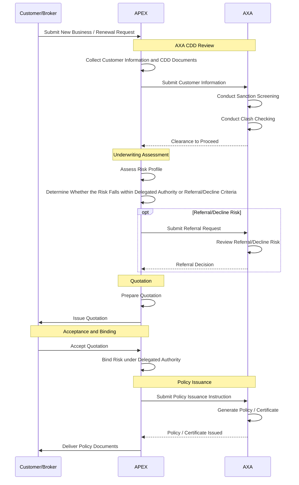

```mermaid
sequenceDiagram
    participant Customer as Customer/Broker
    participant APEX
    participant AXA

    Customer->>APEX: Submit New Business / Renewal Request

    Note over APEX,AXA: AXA CDD Review

    APEX->>APEX: Collect Customer Information and CDD Documents
    APEX->>AXA: Submit Customer Information

    AXA->>AXA: Conduct Sanction Screening
    AXA->>AXA: Conduct Clash Checking

    AXA-->>APEX: Clearance to Proceed

    Note over APEX: Underwriting Assessment

    APEX->>APEX: Assess Risk Profile
    APEX->>APEX: Determine Whether the Risk Falls within Delegated Authority or Referral/Decline Criteria

    opt Referral/Decline Risk
        APEX->>AXA: Submit Referral Request
        AXA->>AXA: Review Referral/Decline Risk
        AXA-->>APEX: Referral Decision
    end

    Note over APEX: Quotation

    APEX->>APEX: Prepare Quotation
    APEX->>Customer: Issue Quotation

    Note over Customer,APEX: Acceptance and Binding

    Customer->>APEX: Accept Quotation
    APEX->>APEX: Bind Risk under Delegated Authority

    Note over APEX,AXA: Policy Issuance

    APEX->>AXA: Submit Policy Issuance Instruction
    AXA->>AXA: Generate Policy / Certificate
    AXA-->>APEX: Policy / Certificate Issued

    APEX->>Customer: Deliver Policy Documents
```    
