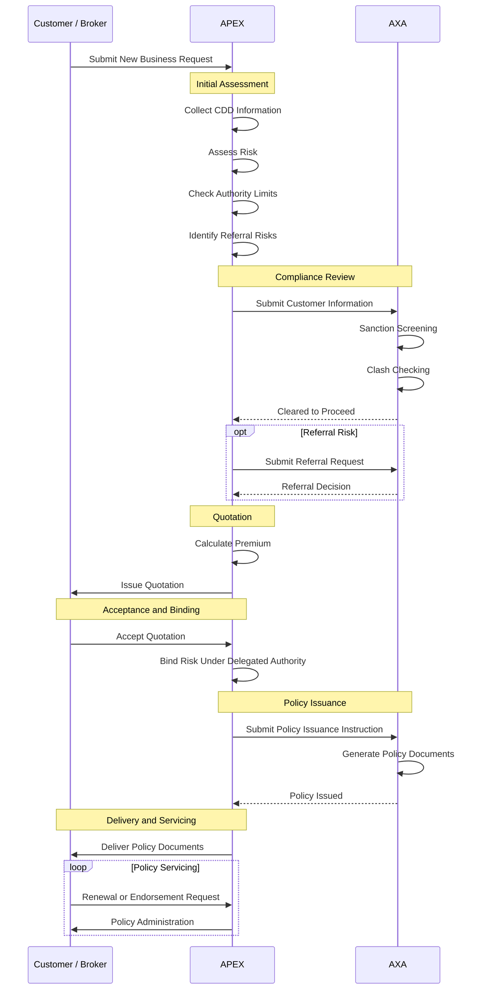

```mermaid
sequenceDiagram
    participant Customer as Customer / Broker
    participant APEX as APEX
    participant AXA as AXA

    Customer->>APEX: Submit New Business Request

    Note over APEX: Initial Assessment
    APEX->>APEX: Collect CDD Information
    APEX->>APEX: Assess Risk
    APEX->>APEX: Check Authority Limits
    APEX->>APEX: Identify Referral Risks

    Note over APEX,AXA: Compliance Review

    APEX->>AXA: Submit Customer Information
    AXA->>AXA: Sanction Screening
    AXA->>AXA: Clash Checking
    AXA-->>APEX: Cleared to Proceed

    opt Referral Risk
        APEX->>AXA: Submit Referral Request
        AXA-->>APEX: Referral Decision
    end

    Note over APEX: Quotation
    APEX->>APEX: Calculate Premium
    APEX->>Customer: Issue Quotation

    Note over Customer,APEX: Acceptance and Binding
    Customer->>APEX: Accept Quotation
    APEX->>APEX: Bind Risk Under Delegated Authority

    Note over APEX,AXA: Policy Issuance
    APEX->>AXA: Submit Policy Issuance Instruction
    AXA->>AXA: Generate Policy Documents
    AXA-->>APEX: Policy Issued

    Note over APEX,Customer: Delivery and Servicing
    APEX->>Customer: Deliver Policy Documents

    loop Policy Servicing
        Customer->>APEX: Renewal or Endorsement Request
        APEX->>Customer: Policy Administration
    end
```    
