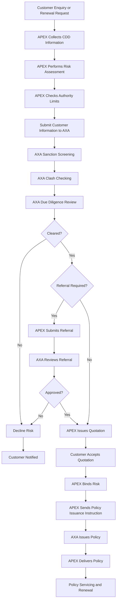

```mermaid
flowchart TD

    A[Customer Enquiry or Renewal Request] --> B[APEX Collects CDD Information]

    B --> C[APEX Performs Risk Assessment]
    C --> D[APEX Checks Authority Limits]

    D --> E[Submit Customer Information to AXA]

    E --> F[AXA Sanction Screening]
    F --> G[AXA Clash Checking]
    G --> H[AXA Due Diligence Review]

    H --> I{Cleared?}

    I -- No --> J[Decline Risk]
    J --> K[Customer Notified]

    I -- Yes --> L{Referral Required?}

    L -- Yes --> M[APEX Submits Referral]
    M --> N[AXA Reviews Referral]

    N --> O{Approved?}

    O -- No --> J
    O -- Yes --> P[APEX Issues Quotation]

    L -- No --> P

    P --> Q[Customer Accepts Quotation]

    Q --> R[APEX Binds Risk]

    R --> S[APEX Sends Policy Issuance Instruction]

    S --> T[AXA Issues Policy]

    T --> U[APEX Delivers Policy]

    U --> V[Policy Servicing and Renewal]
```
