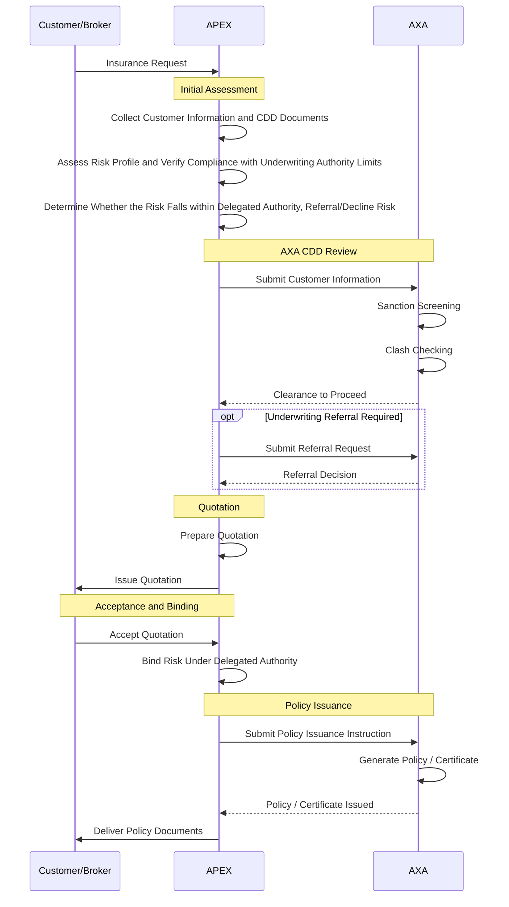

```mermaid
sequenceDiagram
    participant Customer as Customer/Broker
    participant APEX
    participant AXA

    Customer->>APEX: Insurance Request

    Note over APEX: Initial Assessment
    APEX->>APEX: Collect Customer Information and CDD Documents
    APEX->>APEX: Assess Risk Profile and Verify Compliance with Underwriting Authority Limits
    APEX->>APEX: Determine Whether the Risk Falls within Delegated Authority, Referral/Decline Risk
    
    Note over APEX,AXA: AXA CDD Review
    APEX->>AXA: Submit Customer Information
    AXA->>AXA: Sanction Screening
    AXA->>AXA: Clash Checking
    AXA-->>APEX: Clearance to Proceed

    opt Underwriting Referral Required
        APEX->>AXA: Submit Referral Request
        AXA-->>APEX: Referral Decision
    end

    Note over APEX: Quotation
    APEX->>APEX: Prepare Quotation
    APEX->>Customer: Issue Quotation

    Note over Customer,APEX: Acceptance and Binding
    Customer->>APEX: Accept Quotation
    APEX->>APEX: Bind Risk Under Delegated Authority

    Note over APEX,AXA: Policy Issuance
    APEX->>AXA: Submit Policy Issuance Instruction
    AXA->>AXA: Generate Policy / Certificate
    AXA-->>APEX: Policy / Certificate Issued

    APEX->>Customer: Deliver Policy Documents
```    
