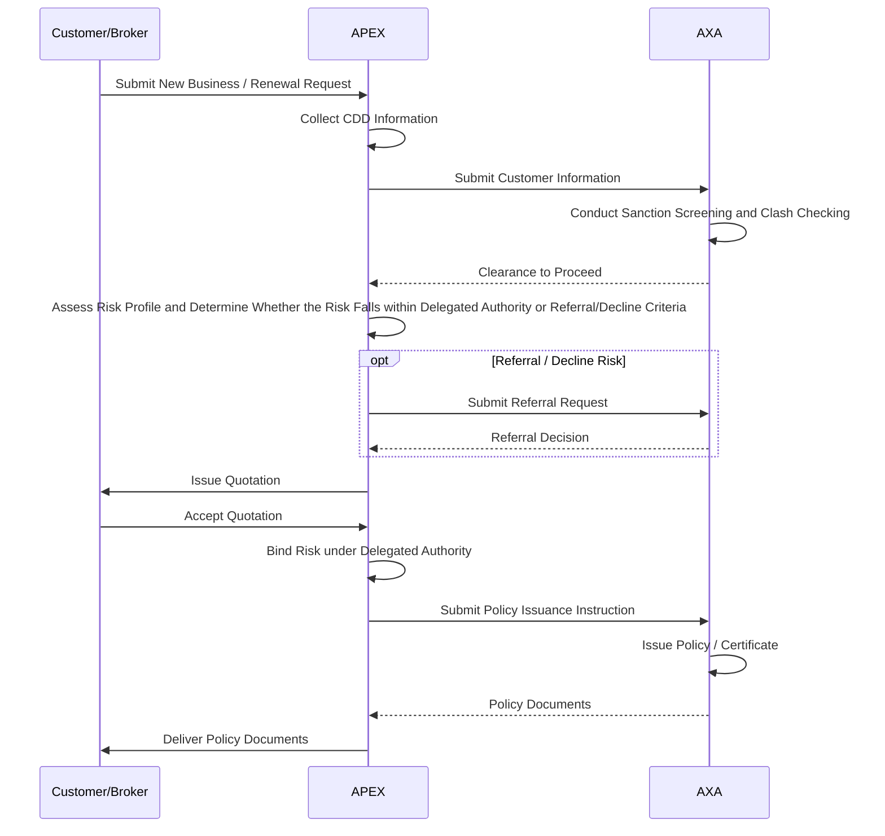

```mermaid
sequenceDiagram
    participant Customer as Customer/Broker
    participant APEX
    participant AXA

    Customer->>APEX: Submit New Business / Renewal Request

    APEX->>APEX: Collect CDD Information
    APEX->>AXA: Submit Customer Information

    AXA->>AXA: Conduct Sanction Screening and Clash Checking
    AXA-->>APEX: Clearance to Proceed

    APEX->>APEX: Assess Risk Profile and Determine Whether the Risk Falls within Delegated Authority or Referral/Decline Criteria

    opt Referral / Decline Risk
        APEX->>AXA: Submit Referral Request
        AXA-->>APEX: Referral Decision
    end

    APEX->>Customer: Issue Quotation

    Customer->>APEX: Accept Quotation
    APEX->>APEX: Bind Risk under Delegated Authority

    APEX->>AXA: Submit Policy Issuance Instruction
    AXA->>AXA: Issue Policy / Certificate
    AXA-->>APEX: Policy Documents

    APEX->>Customer: Deliver Policy Documents
```
